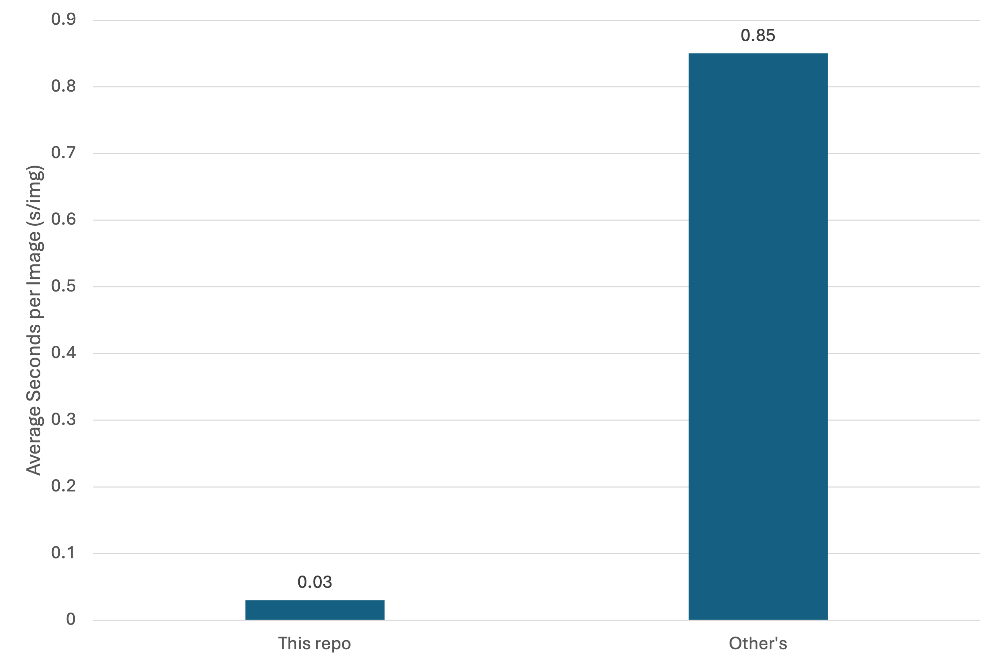
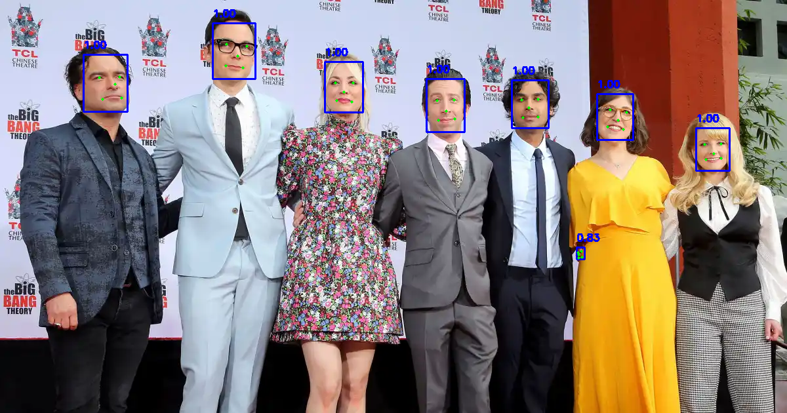

# Real MTCNN PyTorch

The primary reason for reimplementing the MTCNN model is that many repos that call themselves "mtcnn_pytorch" do not use PyTorch throught the process. They repeatedly convert model output tensors into numpy and PIL images, which can cause unnecessary performance issues as data is moved between CPU and GPU constantly. Moreover, many modules like NMS are handcrafted and do not make full use of existing libraires like torchvision that make better use of GPUs. These issues haunted me when I tried to find a fast and easy2use version of MTCNN in my latest [paper](https://arxiv.org/abs/2508.02034). 

Therefore, I rewrote MTCNN in PyTorch completely, with all operations done on GPU and make better use of PyTorch and torchvision. Hope it helps. Plz star the repo if it ever helped you. Thx a lot! (As a CS UG, stars can mean a lot in my resume... BTW, if you are interested in privacy protection against unauthorized face recognition systems, check my latest [paper](https://arxiv.org/abs/2508.02034) and its [code](https://github.com/HKU-TASR/Protego))

## Performance
This repo offers faster speed compared with another often-used implementation of [mtcnn_pytorch](https://github.com/TropComplique/mtcnn-pytorch) using the same environment and machine (Intel Xeon w5-3415 CPU, 1 NVIDIA RTX 5880 Ada GPU (48 GB memory), and 128 GB RAM). 


The detection is rather satisfying. (The weight and relevant hyperparameters are copied from https://github.com/TropComplique/mtcnn-pytorch.)



## How to use?
This repo is more intended to be used as a module, which is why it has minimal requirements and should work with most of the torch, torchvision, numpy, and tqdm versions. But it can run on its own anyway. 
1. Clone the repo with the following command:
```commandline
$ git clone https://github.com/Michael-wzl/mtcnn_pytorch
```
2. Install the dependencies:
Change `requirements.txt` depending on whether you have CUDA devices.
```commandline
$ pip install -r requirements.txt
```
3. Run the demo:
```commandline
$ python demo.py
```
4. Integrate the module into your own code:
```python
import torch

from mtcnn import MTCNN

device = torch.device("cuda:0")
detector = MTCNN(device=device)
img = torch.randn(1, 3, 640, 640).to(device)
boxes, probs = detector(img) # boxes, probs = detector.detect(img)
```
Refer to `demo.py` for more complete example usages.

## Future Work
Currently, we are still feeding the images into the model one by one, without making full use of batch calculation. The primary obstacle is dealing with zero-detection images within a batch. This can be a point of improvement. Also, many operations are still not optimal, like the `_square` and `_calibrate` function. Moreover, we still have misdetections, so the hyperparameters like `nms_thresh` may have to be further tuned. Lastly, if I find that many people are interested in the repo, I will take the trouble to turn it into a library that can be installed through `pip` and `conda` and make sure it has undergone more comprehensive testings. 
